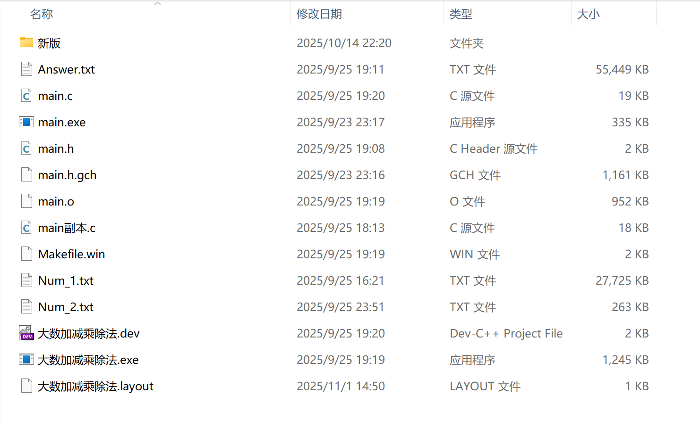
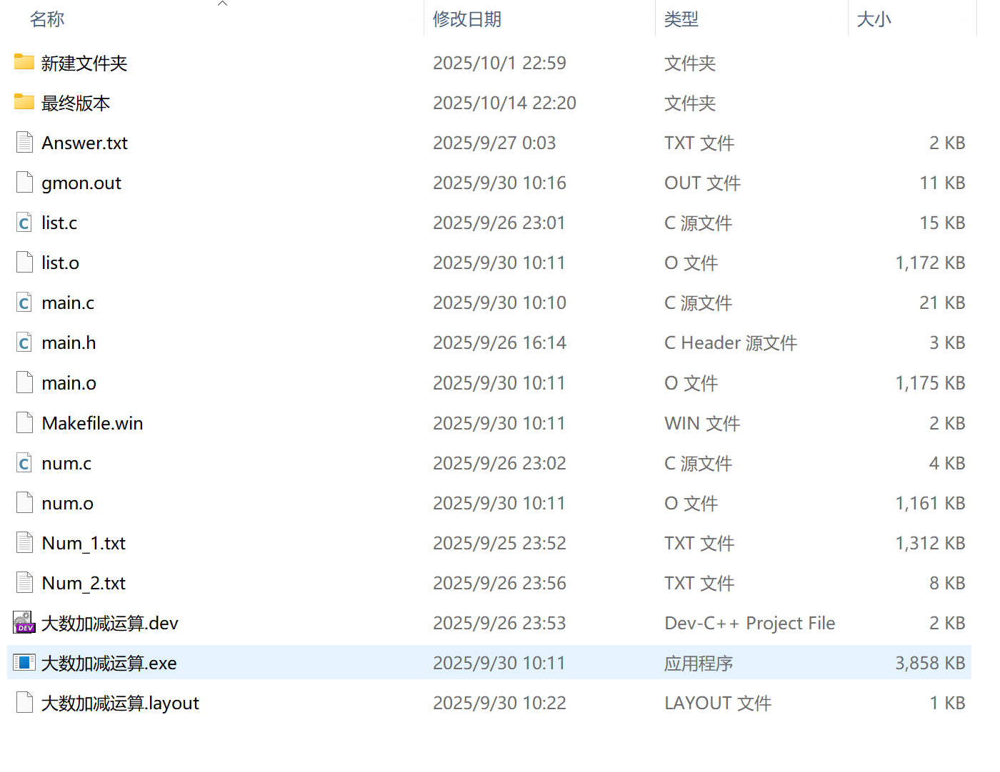
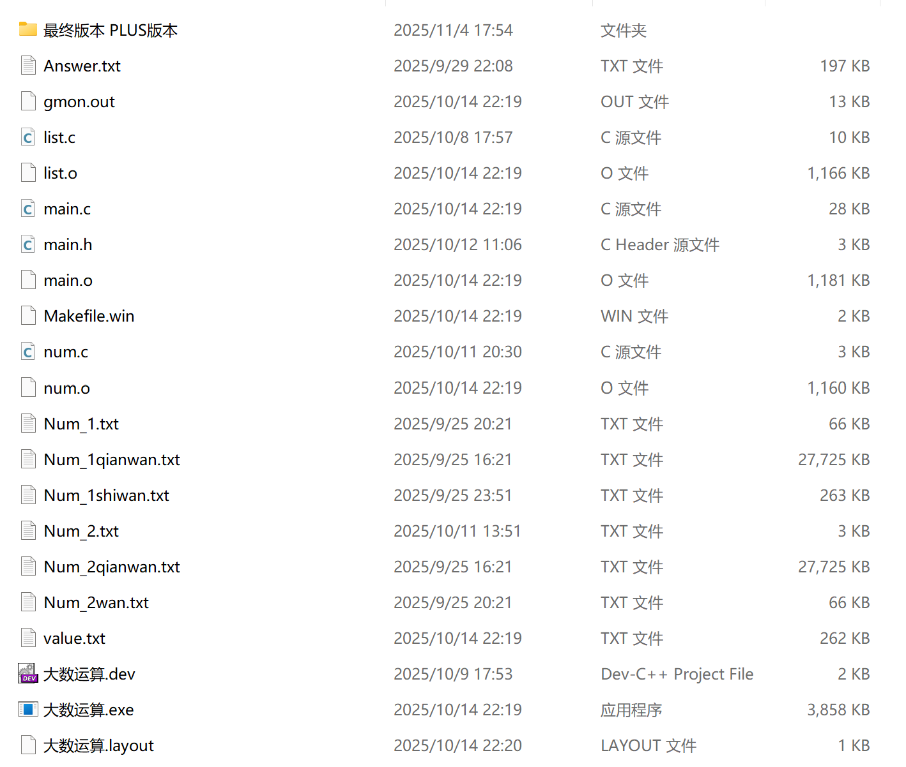
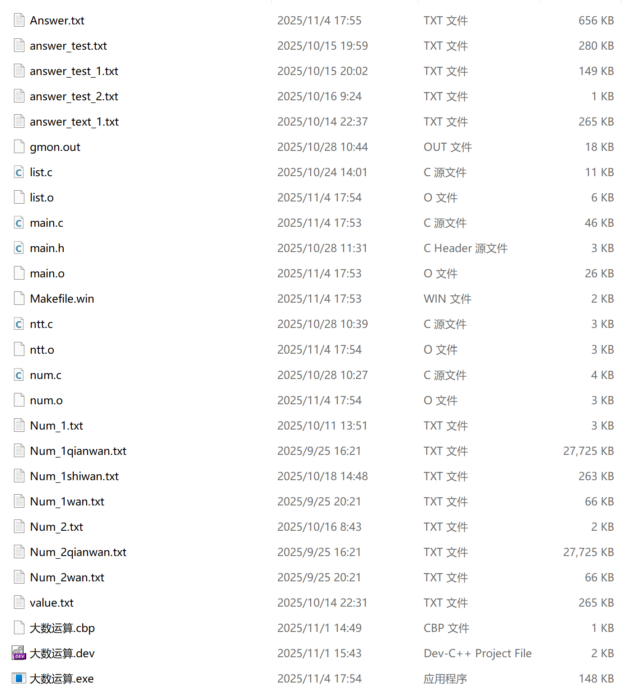

# 大数运算库 (Big-integer-arithmetic Library)

## 项目概述

这是一个用C语言实现的大数运算库，支持任意长度的整数进行加、减、乘、除四种基本运算。项目采用万进制（每四位十进制数作为一个存储单元）来高效存储和运算大数，并实现了多种优化算法以提高性能。

## 技术演进

2025年9月20日，在老师的建议下正式开始大数运算项目，同周，我在devc++上尝试开发。我用链表储存数字，完成了基础的十进制加减乘除法，当时我预估处理万级大数乘法需要数小时以上的时间，这与处理千万级大数的目标还相差甚远，我开始转向更高的算法实现，创建了文件夹“新版”；


在新的文件夹中，我将十进制改为万进制，将效率翻了四倍，同时初步实现了卡拉楚巴卷积乘法，效率翻了几十倍。随后，我删除无用的printf语句，又合并了一些函数，减少函数频繁调用，最终将六万位大数乘法的运算速度优化到了0.7秒左右（当前，十万级别约二十几秒，百万级别需运行了上千秒，两千七百多万级别的大数，需要七八个小时以上）
当时，我尝试了Burnikel-Ziegler算法，但是规范化的时候有点小问题暂时尚不太明白要怎么处理。当时，我对FFT算法已经有所了解，但还没开始实现。
当时，我初步实现了Newton迭代除法，但在一些函数上（初版比大小时没有清除前导零）没做好，导致除法运算很不稳定。


随后一两周，我创建了文件夹“最终版本”，在最终版本中，我建立了完整的报错机制，在一次次debug中不断优化内存处理和算法实现，实现了稳定的Newton迭代除法。随后，我开始研究更高深的乘法算法，以求进一步提高乘法和除法的效率。


在文档“最终版本PLUS版本”中，我一步步实现了DFT乘法，却发现采用单模数的数论变换时受到所选模数的限制，根本无法处理超大数，超过40位的大数就已经无法处理。于是，我开始研读中国剩余原理，并尝试实现多模数DFT乘法，并进一步优化直到实现真正的NNT乘法。


遗憾的是PLUS版本中我也仅实现了了多模数DFT的雏形，后续继续优化的空间还很大，进取无止境，于是我暂时停止了这个项目。转向了其他领域的学习和研究。
2026年1月1日，在掌握更高级的编译本领后我在VScode编译工具中重新整理了我的项目，并将之开源。

## 功能特性

### 1. 基本运算
- **加法**：支持任意长度整数加法
- **减法**：支持任意长度整数减法，自动处理正负号
- **乘法**：实现三种乘法算法：
  - 普通乘法（基础算法）
  - Karatsuba算法（递归分治优化）
  - NTT（数论变换）算法（高性能乘法,目前还在完善中）
- **除法**：实现两种除法算法：
  - 普通长除法
  - 牛顿迭代法（快速求倒数）

### 2. 技术特点
- **高效存储结构**：使用块状链表结构存储大数，每块存储4位十进制数（万进制）
- **内存管理**：动态内存分配与释放，避免内存泄漏，使用链表储存大数，能兼容碎片化的内存环境
- **编码支持**：控制台支持UTF-8编码
- **文件I/O**：支持从文件读取大数和输出结果

## 项目结构

```
Big_integer_arithmetic/
├── CMakeLists.txt              # CMake 构建配置文件
├── build/                      # 编译输出目录
├── include/                    # 头文件目录
│   └── main.h                  # 主头文件（包含所有函数声明和数据结构定义）
├── src/                        # 源代码目录
│   ├── main.c                  # 主程序文件（包含主函数和主要运算逻辑）
│   ├── list.c                  # 链表相关操作实现
│   ├── num.c                   # 大数基本操作实现
│   └── ntt.c                   # NTT（数论变换）算法辅助
├── test/                       # 测试数据目录
│   └── Num_1shiwan.txt
│   └── ...
└── output/                     # 程序输出目录
    └── answer.txt              # 运算结果输出文件
    └── ...
```

## 使用方法

### 1. 输入大数
程序支持两种输入方式：

**方式一：文件输入（默认）**
```c
FILE *fp = fopen("test\\Num_1shiwan.txt","r");
Num num_1 = fgetNum(fp);
```

**方式二：控制台输入**
```c
printf("请输入两个大数：\n");
Num num_1 = getNum();
Num num_2 = getNum();
```

### 2. 选择运算
程序运行后会提示选择运算类型：
```
请输入您想要进行的运算：(+-*/)
```
输入对应的运算符即可进行相应运算。

### 3. 查看结果
运算结果会：
- 在控制台显示
- 保存到 `output/answer.txt` 文件中

## 性能特点

### 整数表示范围
- **int**：最大10位数字（2147483647）
- **long long**：最大19位数字（9223372036854775807）
- **本库**：理论上无限制，受内存大小约束

---

欢迎大家提交问题和改进建议。
本项目仅供学习交流使用。

---
**作者**：浙江大学学生-绿意不息  
**版本**：1.0  
**此版本代码完成时间**：2025年11月4日
**更新日期**：
- 2026年1月1日：整理并开源1.0版本
- 2026年1月2日：修改并完善README，添加了研究历程
